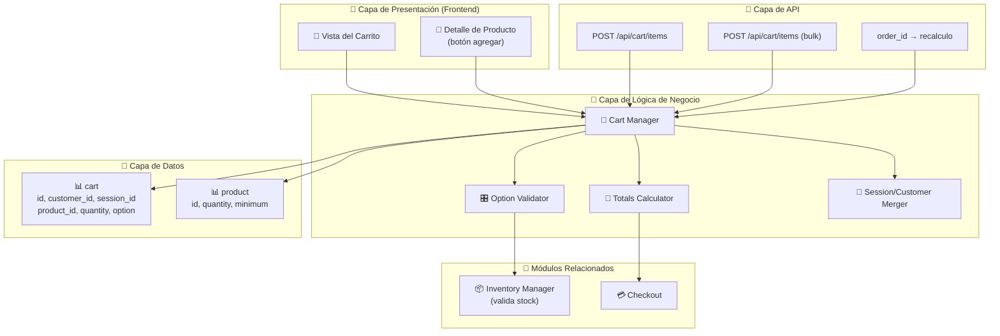
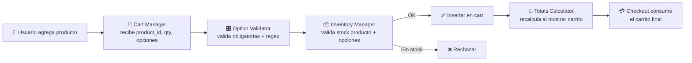
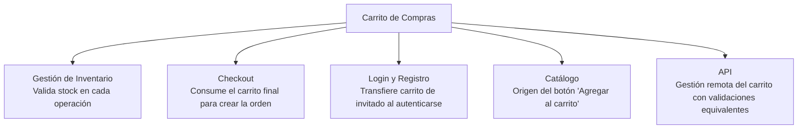

# Diagrama: Arquitectura del Módulo - Carrito de Compras

## Descripción

Este diagrama muestra la arquitectura del módulo de Carrito de Compras, sus componentes,
entidades de base de datos y relaciones.

---

## Arquitectura de Componentes



---

## Flujo de Datos



---

## Componentes Clave

### 🛒 Cart Manager
**Responsabilidad**: Orquestar agregar, editar y eliminar productos
- Resolver producto maestro/variante
- Persistir el carrito asociado a sesión o cliente
- Disparar limpieza de envío/pago tras cualquier cambio

### 🎛️ Option Validator
**Responsabilidad**: Validar opciones seleccionadas
- Verificar opciones obligatorias completas
- Validar expresiones regulares en opciones tipo texto
- Validar planes de suscripción cuando el producto los requiere

### 🧮 Totals Calculator
**Responsabilidad**: Calcular totales del carrito
- Sumar precios (incluyendo impacto de opciones)
- Aplicar impuestos según configuración fiscal
- Integrar extensiones de tipo total (cupones, envío, recompensas)

### 🔀 Session/Customer Merger
**Responsabilidad**: Persistencia entre sesión e identidad
- Asociar el carrito a `session_id` (invitado) o `customer_id` (autenticado)
- Transferir productos de invitado a cuenta al iniciar sesión
- Expirar automáticamente carritos de invitado abandonados

---

## Integraciones



---

## Configuraciones del Módulo

```
config_cart:
  ├── config_customer_price (bool) — Ocultar precios sin autenticación
  ├── cart_weight_display (bool) — Mostrar peso total del carrito
  └── cart_expire_guest (int) — Días antes de expirar carrito de invitado

config_stock (compartida con Inventario):
  ├── allow_out_of_stock (bool)
  └── require_minimum_qty (bool)
```

---

## Seguridad y Validación

- ✅ **Validación equivalente API/Web**: la API del carrito aplica las mismas reglas que el
  frontend (RF-CART-057 a RF-CART-070)
- ✅ **Errores estructurados**: la API devuelve errores identificando producto y opción
  específica que falló
- ✅ **Delegación de stock**: el carrito no duplica lógica de inventario, siempre consulta al
  Inventory Manager
- ✅ **Verificado con pruebas unitarias**: `ShoppingCartTest.php` (parte de la suite de 613
  tests que corre en CI, ver
  [`.github/workflows/unitarias.yml`](../../.github/workflows/unitarias.yml))
