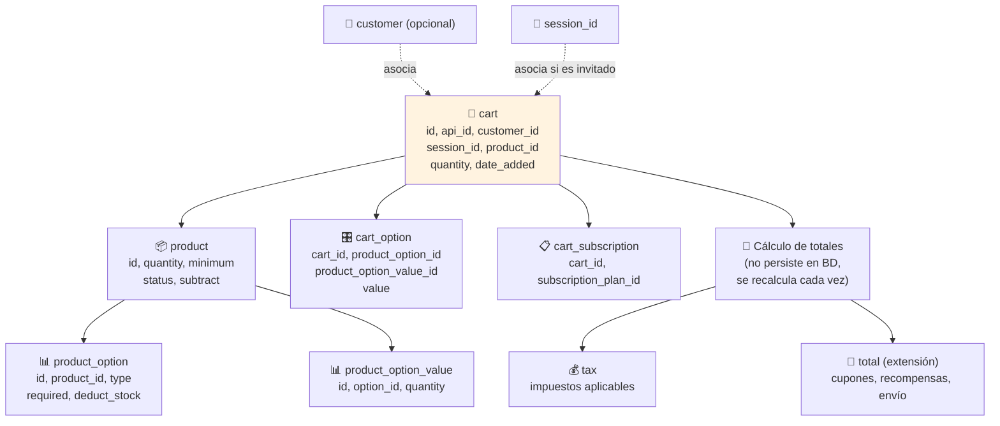

# Diagrama: Estructura de Datos - Carrito de Compras

## Descripción

Este diagrama muestra las entidades involucradas en el carrito de compras: productos, opciones
seleccionadas, sesión/cliente asociado, y su relación con inventario para validación de stock.

---

## Estructura de Entidades



---

## Entidades de Base de Datos

### 🛒 cart
```
+------------------+----------+-----+
| Campo            | Tipo     | FK  |
+------------------+----------+-----+
| cart_id           | INT      | PK  |
| api_id            | INT      |     |
| customer_id       | INT      | FK  |
| session_id        | VARCHAR  |     |
| product_id        | INT      | FK  |
| recurring_id      | INT      |     |
| option            | TEXT     |     |
| quantity          | INT      |     |
| date_added        | DATETIME |     |
+------------------+----------+-----+

Nota: customer_id=0 significa carrito de invitado, identificado por session_id.
'option' guarda las opciones seleccionadas serializadas (JSON).
```

### 🎛️ Opciones seleccionadas (dentro de cart.option)
```
+------------------------+----------+
| Campo                  | Tipo     |
+------------------------+----------+
| product_option_id        | INT      |
| product_option_value_id   | INT      |
| value                     | VARCHAR  |
+------------------------+----------+

Nota: para opciones tipo texto/archivo, 'value' guarda el texto o la ruta del archivo.
```

### 📋 Suscripción asociada
```
+------------------------+----------+
| Campo                  | Tipo     |
+------------------------+----------+
| subscription_plan_id      | INT      |
+------------------------+----------+

Nota: obligatorio si el producto tiene planes de suscripcion configurados.
```

---

## Relaciones Clave

```
customer (0..1) ──── (N) cart          [carrito de cliente autenticado]
session (0..1) ──── (N) cart           [carrito de invitado]
product (1) ──── (N) cart              [un producto puede estar en muchos carritos]
cart (1) ──── (N) opciones serializadas [dentro del campo 'option']

product (1) ──── (N) product_option
product_option (1) ──── (N) product_option_value
```

---

## Ciclo de Vida del Carrito

| Estado | Identificador | Persistencia | Transición |
|---|---|---|---|
| **Invitado** | `session_id` | Hasta expiración de sesión o limpieza automática | Se transfiere a cliente al iniciar sesión |
| **Autenticado** | `customer_id` | Persiste entre sesiones del mismo cliente | Se vacía al confirmar un pedido exitosamente |
| **Abandonado** | `session_id` sin actividad | Eliminado automáticamente tras expirar | No se recupera |

---

## Validaciones Contra Inventario

El carrito no valida stock por sí mismo — delega esa responsabilidad al módulo de
**Gestión de Inventario** en cada operación:

```
cart.add()    → InventoryManager.validateProductQuantity() + validateOptionQuantity()
cart.edit()   → InventoryManager.validateProductQuantity() (con nueva cantidad total)
cart.list()   → InventoryManager.getStockStatus() (para mostrar disponibilidad actual)
checkout      → InventoryManager.validateCheckoutQuantity() (revalidación final)
```

Ver [Estructura de Datos — Gestión de Inventario](gestion-inventario-estructura-variantes.md)
para el detalle completo de esas validaciones.
