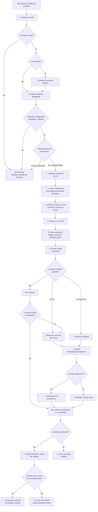

# Diagrama: Flujo del Carrito de Compras

## Descripción

Este diagrama muestra cómo un cliente agrega, modifica y elimina productos del carrito, y cómo
persiste ese carrito entre sesiones y autenticaciones.

---

## Flujo del Carrito

---

## Puntos Clave

1. **Validación previa a agregar**: existencia del producto, resolución de variantes, opciones
   obligatorias y plan de suscripción, todo antes de insertar en el carrito.
2. **Limpieza de estado en cascada**: agregar, editar o eliminar un producto limpia
   automáticamente métodos de envío/pago y recompensas ya calculados, para evitar
   inconsistencias con el nuevo contenido del carrito.
3. **Persistencia dual**: el carrito se asocia a la sesión (invitado) o al cliente
   (autenticado), y se transfiere automáticamente al iniciar sesión dentro de la misma sesión de
   navegador.
4. **Carritos de invitado expiran**: se limpian automáticamente tras un tiempo configurado, sin
   intervención del usuario.

---

## Escenarios Cubiertos

- ✅ Agregar producto con stock disponible
- ✅ Rechazo al no seleccionar opción obligatoria
- ✅ Ver carrito con totales calculados
- ✅ Actualizar cantidad (aumentar y reducir)
- ✅ Reducir cantidad a 0 elimina el producto
- ✅ Eliminar producto, con y sin productos restantes
- ✅ Transferencia de carrito de invitado a cuenta autenticada (⏳ pendiente de verificación
  manual completa, ver [Historia de Usuario 5](../../tests/aceptacion/3-Carrito-de-Compras.md#historia-de-usuario-5-mi-carrito-persiste-aunque-cierre-sesión-o-cambie-de-dispositivo))
