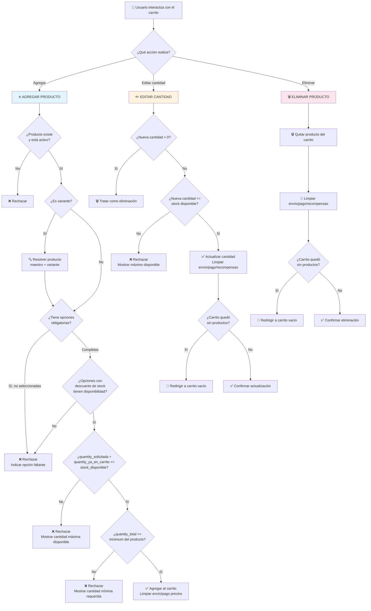

# Diagrama: Procesos de Validación - Carrito de Compras

## Descripción

Árbol de decisiones para agregar, editar y eliminar productos del carrito, incluyendo
validaciones de stock, opciones y límites de cantidad.

---

## Árbol de Decisiones de Validación



---

## Matriz de Validación por Acción

| Acción | Valida existencia | Valida stock | Valida mínimo | Valida opciones | Limpia envío/pago |
|---|---|---|---|---|---|
| **Agregar** | ✅ | ✅ | ✅ | ✅ | ✅ |
| **Editar cantidad** | N/A (ya en carrito) | ✅ | ❌ (no revalida mínimo al editar) | ❌ | ✅ |
| **Eliminar** | N/A | N/A | N/A | N/A | ✅ |

---

## Flujos Críticos

### 🔴 Flujo: Cantidad acumulada excede el stock
```
Producto ya tiene 8 unidades en el carrito → stock disponible = 10 →
Usuario intenta agregar 5 más (total 13) → Sistema rechaza →
Indica que solo puede agregar 2 unidades adicionales
```

### 🟡 Flujo: Opción sin stock al agregar
```
Usuario selecciona una opción con descuento de inventario activado →
Opción tiene 0 unidades disponibles → Sistema rechaza el agregado completo →
Indica qué opción específica no tiene stock
```

### 🟢 Flujo: Edición exitosa que vacía el carrito
```
Carrito tiene 1 producto → Usuario reduce cantidad a 0 →
Sistema trata la operación como eliminación → Carrito queda vacío →
Se limpia toda información de checkout previamente calculada
```

---

## Puntos de Tolerancia

### Recalculo delegado a Inventario
El carrito no mantiene su propia lógica de validación de stock — delega completamente en el
módulo de Gestión de Inventario (`InventoryManager`), evitando duplicar reglas de negocio en dos
lugares distintos.

### Limpieza en cascada
Cualquier modificación del carrito (agregar, editar, eliminar) dispara la limpieza de métodos de
envío, pago y recompensas ya calculados, forzando su recálculo en el siguiente paso de checkout.
Esto previene que un cliente pague un costo de envío calculado sobre un carrito distinto al que
finalmente confirma.
