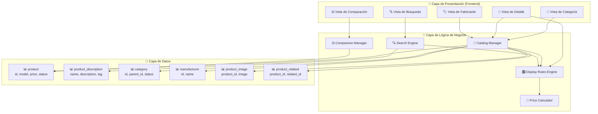
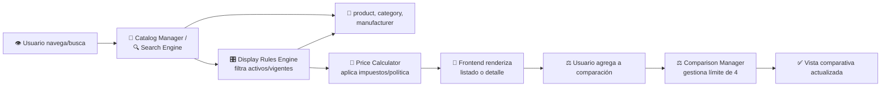
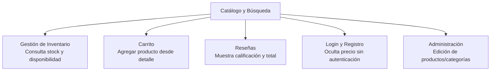

# Diagrama: Arquitectura del Módulo - Catálogo y Búsqueda

## Descripción

Este diagrama muestra la arquitectura del módulo de Catálogo y Búsqueda, sus componentes,
entidades de base de datos y relaciones.

---

## Arquitectura de Componentes



---

## Flujo de Datos



---

## Componentes Clave

### 📂 Catalog Manager
**Responsabilidad**: Navegación y listado de productos
- Construir jerarquía de categorías y breadcrumbs
- Listar productos por categoría o fabricante
- Aplicar filtros, orden y paginación

### 🔍 Search Engine
**Responsabilidad**: Búsqueda de productos por texto
- Buscar en nombre, y opcionalmente descripción/etiquetas
- Soportar limitación por categoría y subcategorías
- Mantener filtros al cambiar orden/página/límite

### ⚖️ Comparison Manager
**Responsabilidad**: Gestión de la lista de comparación en sesión
- Agregar/quitar productos (máximo 4)
- Reemplazar el más antiguo al superar el límite (FIFO)
- Limpiar productos que ya no existen

### 🎛️ Display Rules Engine
**Responsabilidad**: Reglas de visualización consistentes
- Filtrar productos inactivos, no vigentes o no habilitados
- Decidir si mostrar precio según autenticación
- Truncar descripciones largas, usar imagen placeholder

### 🧮 Price Calculator
**Responsabilidad**: Cálculo de precio final mostrado
- Aplicar precio especial/descuento si corresponde
- Sumar impuestos según configuración fiscal
- Ocultar el precio si la política de cliente lo requiere

---

## Integraciones



---

## Configuraciones del Módulo

```
config_catalog:
  ├── config_limit (int) — Productos por página por defecto
  ├── config_product_description_length (int) — Longitud antes de truncar
  ├── config_customer_price (bool) — Ocultar precios sin autenticación
  ├── config_tax (bool) — Mostrar impuestos en listados/detalle
  └── config_compare (int) — Máximo de productos en comparación (default 4)

config_search:
  ├── search_description (bool) — Incluir descripción en la búsqueda
  └── search_tag (bool) — Incluir etiquetas en la búsqueda
```

---

## Seguridad y Validación

- ✅ **Filtrado consistente**: solo productos activos, vigentes y habilitados aparecen en
  cualquier vista pública
- ✅ **Resistencia a inyección SQL**: verificado en `CatalogTest.php::testSearchProductsSqlInjection`
  y en el checklist de seguridad no funcional (ver
  [`tests/no-funcionales/seguridad/checklist-owasp.md`](../../tests/no-funcionales/seguridad/checklist-owasp.md))
- ✅ **Búsqueda case-insensitive**: verificado en `testSearchProductsCaseFold`
- ⚠️ **Marcas/Fabricantes sin pruebas unitarias dedicadas**: ver observación en
  [4.2.4 — Resultado de pruebas de Catálogo y Búsqueda](https://github.com/DanLAQP/QA-OpenCart-Testing/wiki/4.2.4-Resultado-de-pruebas-Catalogo-Busqueda)
  de la wiki del proyecto
