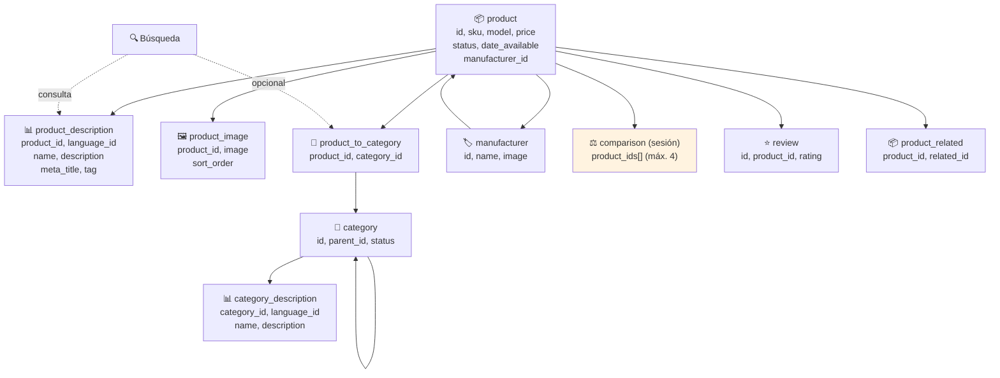

# Diagrama: Estructura de Datos - Catálogo y Búsqueda

## Descripción

Este diagrama muestra las entidades de base de datos involucradas en la navegación, búsqueda,
detalle de producto, comparación y catálogo por fabricante.

---

## Estructura de Entidades



---

## Entidades de Base de Datos

### 📦 product
```
+------------------+----------+-----+
| Campo            | Tipo     | FK  |
+------------------+----------+-----+
| product_id        | INT      | PK  |
| model             | VARCHAR  |     |
| sku               | VARCHAR  |     |
| price             | DECIMAL  |     |
| manufacturer_id   | INT      | FK  |
| status            | BOOLEAN  |     |
| date_available    | DATE     |     |
+------------------+----------+-----+
```

### 📊 product_description
```
+------------------+----------+-----+
| Campo            | Tipo     | FK  |
+------------------+----------+-----+
| product_id        | INT      | FK  |
| language_id       | INT      | FK  |
| name              | VARCHAR  |     |
| description       | TEXT     |     |
| meta_title        | VARCHAR  |     |
| tag               | VARCHAR  |     |
+------------------+----------+-----+

Nota: 'tag' se usa para búsqueda por etiquetas cuando esta habilitada.
```

### 📂 category
```
+------------------+----------+-----+
| Campo            | Tipo     | FK  |
+------------------+----------+-----+
| category_id       | INT      | PK  |
| parent_id         | INT      | FK  |
| status            | BOOLEAN  |     |
+------------------+----------+-----+

Nota: parent_id apunta a category_id, permitiendo jerarquia de hasta 3 niveles.
```

### 🏷️ manufacturer
```
+------------------+----------+-----+
| Campo            | Tipo     | FK  |
+------------------+----------+-----+
| manufacturer_id   | INT      | PK  |
| name              | VARCHAR  |     |
| image             | VARCHAR  |     |
+------------------+----------+-----+

Nota: se agrupan alfabeticamente y en el grupo "0-9" cuando corresponde.
```

### ⚖️ comparison (sesión, no persistido en BD)
```
+------------------+----------+
| Campo            | Tipo     |
+------------------+----------+
| product_ids       | ARRAY    |
+------------------+----------+

Nota: maximo 4 productos. Al superar el limite, se elimina el mas antiguo (FIFO).
```

### ⭐ review (referenciado, ver módulo de Reseñas)
```
+------------------+----------+-----+
| Campo            | Tipo     | FK  |
+------------------+----------+-----+
| review_id         | INT      | PK  |
| product_id        | INT      | FK  |
| rating            | INT      |     |
+------------------+----------+-----+

Nota: se usa para calcular calificacion promedio y conteo en el detalle de producto.
```

---

## Relaciones Clave

```
manufacturer (1) ──── (N) product
category (1) ──── (N) category            [jerarquía, hasta 3 niveles]
category (N) ──── (N) product             [vía product_to_category]
product (1) ──── (N) product_description  [una por idioma]
product (1) ──── (N) product_image
product (1) ──── (N) review
product (N) ──── (N) product              [vía product_related]
```

---

## Datos Considerados en Cada Vista

| Vista | Datos mostrados |
|---|---|
| **Listado de categoría** | Imagen, nombre, precio, disponibilidad |
| **Resultados de búsqueda** | Imagen, nombre, descripción resumida, precio, impuestos (si aplica) |
| **Detalle de producto** | Todo lo anterior + fabricante, modelo, códigos, opciones, suscripciones, reseñas, relacionados |
| **Comparación** | Imagen, precio, fabricante, disponibilidad, mínimo, rating, reseñas, peso, dimensiones |
| **Catálogo por fabricante** | Igual que categoría, filtrado por `manufacturer_id` |
