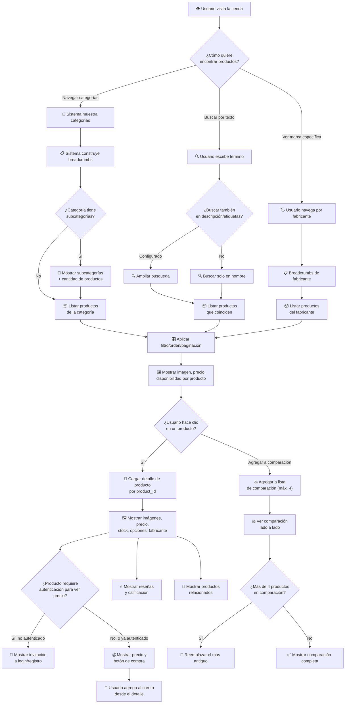

# Diagrama: Flujo de Catálogo y Búsqueda

## Descripción

Este diagrama muestra cómo un cliente descubre productos: navegación por categorías, búsqueda
por texto, visualización del detalle de producto, y comparación entre varios productos.

---

## Flujo de Catálogo y Búsqueda

---

## Puntos Clave

1. **Navegación jerárquica**: categorías pueden tener subcategorías, con breadcrumbs que
   reflejan la ruta completa hasta el usuario.
2. **Búsqueda configurable**: el alcance de la búsqueda (solo nombre, o también descripción y
   etiquetas) depende de la configuración de la tienda.
3. **Precios condicionados a autenticación**: si la política de la tienda lo requiere, el precio
   se oculta hasta que el usuario inicia sesión.
4. **Comparación limitada a 4 productos**: al superar el límite, se descarta el producto más
   antiguo de la lista automáticamente.
5. **Consistencia con reglas de visualización**: solo se muestran productos activos, vigentes
   (fecha de disponibilidad) y habilitados para la tienda/idioma actual.

---

## Escenarios Cubiertos

- ✅ Navegación por categoría con subcategorías
- ✅ Búsqueda por texto con y sin resultados
- ✅ Búsqueda ampliada a descripción/etiquetas
- ✅ Visualización de detalle de producto completo
- ✅ Ocultar precio para usuarios no autenticados
- ✅ Agregar y ver productos en comparación
- ✅ Reemplazo automático al superar el límite de comparación
- ✅ Navegación por fabricante/marca
