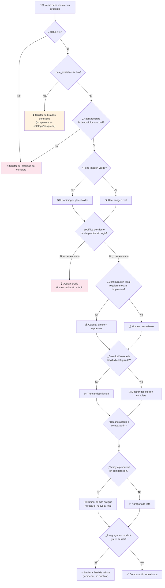

# Diagrama: Procesos de Validación - Catálogo y Búsqueda

## Descripción

Árbol de decisiones para las reglas de visualización de productos: qué se muestra, cuándo se
oculta un precio, y cómo se gestiona el límite de comparación.

---

## Árbol de Decisiones de Validación



---

## Matriz de Validación por Punto

| Punto | Valida | Resultado si falla | Resultado si pasa |
|---|---|---|---|
| **Visibilidad general** | `status`, `date_available`, tienda/idioma | Ocultar del catálogo | Continuar evaluando |
| **Imagen** | Existencia de imagen válida | Usar placeholder | Usar imagen real |
| **Precio** | Política de autenticación | Ocultar + invitar a login | Mostrar precio (con o sin impuestos) |
| **Descripción** | Longitud configurada | Truncar | Mostrar completa |
| **Comparación** | Límite de 4 productos | Eliminar el más antiguo (FIFO) | Agregar directamente |
| **Comparación (reagregar)** | Producto ya en la lista | Reordenar al final | No aplica (ya no está duplicado) |

---

## Flujos Críticos

### 🔴 Flujo: Producto con fecha futura
```
Producto tiene date_available en el futuro → No aparece en catálogo/búsqueda →
Fecha llega → Producto aparece automáticamente en el siguiente listado
```

### 🟡 Flujo: Precio oculto por política de cliente
```
Usuario no autenticado visita detalle de producto → config_customer_price=true →
Precio oculto → Se muestra invitación a login/registro →
Usuario inicia sesión → Precio visible
```

### 🟢 Flujo: Comparación con reemplazo
```
Usuario tiene 4 productos en comparación → Agrega un 5to producto →
Sistema elimina el más antiguo → Nuevo producto se agrega al final →
Comparación sigue mostrando exactamente 4 productos
```

---

## Puntos de Tolerancia

### Productos sin imagen
- Se usa una imagen placeholder configurable, sin bloquear la visualización del producto.

### Búsqueda sin resultados
- No se considera un error: se muestra un mensaje amigable, manteniendo la estructura de la
  página (breadcrumbs, filtros) para que el usuario pueda ajustar su búsqueda.

### Productos eliminados que siguen en comparación
- Si un producto deja de existir mientras está en la lista de comparación de un usuario, se
  limpia automáticamente de la lista en la siguiente consulta.
