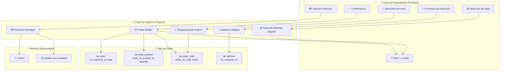
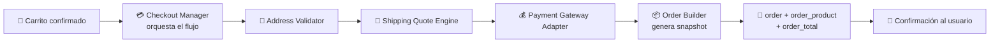
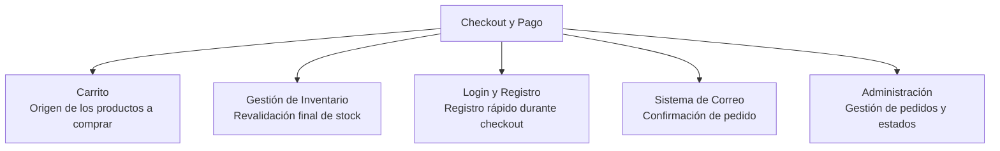

# Diagrama: Arquitectura del Módulo - Checkout y Pago

## Descripción

Este diagrama muestra la arquitectura del módulo de Checkout y Pago, sus componentes,
entidades de base de datos y relaciones.

---

## Arquitectura de Componentes



---

## Flujo de Datos



---

## Componentes Clave

### 💳 Checkout Manager
**Responsabilidad**: Orquestar todo el flujo de checkout
- Validar entrada (carrito válido, stock, mínimos)
- Coordinar el avance entre pasos (dirección → envío → pago → confirmación)
- Disparar la revalidación final antes de generar la orden

### 📍 Address Validator
**Responsabilidad**: Validar direcciones de pago y envío
- Verificar campos obligatorios según el país (código postal, zona)
- Soportar campos personalizados con regex
- Guardar la dirección asociada al cliente o a la sesión de invitado

### 🚚 Shipping Quote Engine
**Responsabilidad**: Cotizar y validar métodos de envío
- Consultar métodos disponibles según la dirección de envío
- Validar que el método seleccionado exista entre los cotizados
- Persistir el método elegido como línea de `order_total`

### 💰 Payment Gateway Adapter
**Responsabilidad**: Integración con métodos de pago
- Obtener métodos disponibles según dirección/configuración
- Procesar el pago (o delegar a la pasarela externa)
- Reportar éxito/fallo al Order Builder

### 📦 Order Builder
**Responsabilidad**: Generar el snapshot final de la orden
- Congelar productos, precios y opciones al momento de confirmar
- Construir todas las líneas de `order_total` (subtotal, envío, impuestos, cupón)
- Registrar el estado inicial en `order_history`

---

## Integraciones



---

## Configuraciones del Módulo

```
config_checkout:
  ├── config_checkout_guest (bool) — Permitir checkout como invitado
  ├── config_shipping (bool) — Requerir envío por defecto
  ├── config_tax (bool) — Calcular impuestos en totales
  └── config_account_id (int) — Página de términos requerida antes de confirmar

config_payment:
  └── métodos habilitados por extensión (ej. PayPal, transferencia, contra entrega)
```

---

## Seguridad y Validación

- ✅ **Snapshot inmutable**: la orden congela precios/productos al momento de confirmar,
  independiente de cambios posteriores al catálogo
- ✅ **Revalidación final de stock**: última verificación antes de generar la orden
  (RF-CHK-068, ya cubierto en RF-INV-018)
- ✅ **Limpieza en cascada**: cambiar cualquier paso anterior invalida cotizaciones ya
  calculadas, evitando inconsistencias
- ⚠️ **Manejo de errores de infraestructura**: ver
  [INC-DISP-001](../../tests/no-funcionales/disponibilidad/incident-reports/INC-DISP-001-error-no-controlado-sin-bd.md)
  — un fallo de base de datos durante el checkout expone un error técnico en vez de la pantalla
  de fallo amigable esperada
