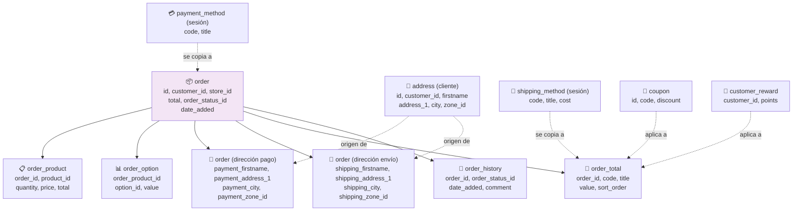

# Diagrama: Estructura de Datos - Checkout y Pago

## Descripción

Este diagrama muestra las entidades involucradas en el proceso de checkout: direcciones,
métodos de envío/pago, y la orden final generada.

---

## Estructura de Entidades



---

## Entidades de Base de Datos

### 📦 order
```
+------------------------+----------+-----+
| Campo                  | Tipo     | FK  |
+------------------------+----------+-----+
| order_id                 | INT      | PK  |
| customer_id              | INT      | FK  |
| store_id                 | INT      | FK  |
| order_status_id          | INT      | FK  |
| total                    | DECIMAL  |     |
| payment_method           | VARCHAR  |     |
| shipping_method          | VARCHAR  |     |
| comment                  | TEXT     |     |
| date_added               | DATETIME |     |
+------------------------+----------+-----+

Nota: order_status_id=0 significa orden "incompleta" (aun no confirmada exitosamente).
```

### 📋 order_product
```
+------------------------+----------+-----+
| Campo                  | Tipo     | FK  |
+------------------------+----------+-----+
| order_product_id          | INT      | PK  |
| order_id                 | INT      | FK  |
| product_id                | INT      | FK  |
| quantity                 | INT      |     |
| price                    | DECIMAL  |     |
| total                    | DECIMAL  |     |
+------------------------+----------+-----+

Nota: snapshot del carrito en el momento de confirmar, independiente de cambios futuros al producto.
```

### 🧮 order_total
```
+------------------------+----------+-----+
| Campo                  | Tipo     | FK  |
+------------------------+----------+-----+
| order_total_id            | INT      | PK  |
| order_id                 | INT      | FK  |
| code                     | VARCHAR  |     |
| title                    | VARCHAR  |     |
| value                    | DECIMAL  |     |
| sort_order               | INT      |     |
+------------------------+----------+-----+

Nota: cada linea de total (subtotal, envio, impuestos, cupon, total) es un registro separado,
permitiendo extensiones de tipo "total" configurables.
```

### 📜 order_history
```
+------------------------+----------+-----+
| Campo                  | Tipo     | FK  |
+------------------------+----------+-----+
| order_history_id          | INT      | PK  |
| order_id                 | INT      | FK  |
| order_status_id          | INT      | FK  |
| comment                  | TEXT     |     |
| date_added               | DATETIME |     |
+------------------------+----------+-----+

Nota: cada cambio de estado de la orden (pendiente, procesando, completado, fallido) genera un registro.
```

---

## Relaciones Clave

```
customer (0..1) ──── (N) order        [invitados tienen customer_id=0 o NULL]
order (1) ──── (N) order_product       [snapshot de productos comprados]
order_product (1) ──── (N) order_option [opciones seleccionadas por línea]
order (1) ──── (N) order_total         [líneas de subtotal/envío/impuestos/cupón/total]
order (1) ──── (N) order_history       [historial de cambios de estado]
```

---

## Ciclo de Vida de la Orden

| Estado | order_status_id | Significado |
|---|---|---|
| **Incompleta** | 0 | Checkout iniciado pero no confirmado; puede recuperarse desde sesión |
| **Pendiente** | 1 | Confirmada, esperando procesamiento de pago |
| **Procesando** | 2+ | Pago en proceso o confirmado, según el método |
| **Completada** | según config | Pedido finalizado exitosamente |
| **Fallida/Cancelada** | según config | El pago o el checkout no se completó |

---

## Datos que se "Congelan" al Confirmar

A diferencia del carrito (que siempre refleja el estado actual del producto), la orden guarda
un **snapshot inmutable** del momento de la compra:

```
Carrito (dinámico)          →    Orden (snapshot fijo)
─────────────────────            ─────────────────────
product.price (actual)      →    order_product.price (al momento de comprar)
product.quantity (actual)    →    order_product.quantity (comprada)
cart.option (referencia)     →    order_option (copia serializada)
```

Esto asegura que un cambio de precio posterior no afecte pedidos ya confirmados.
