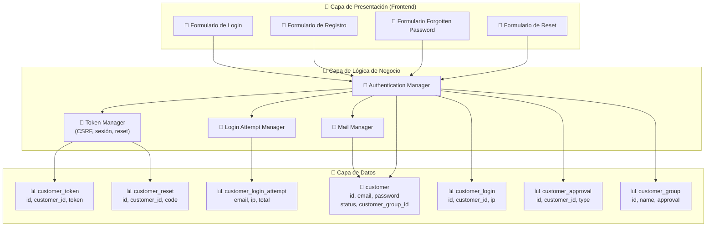
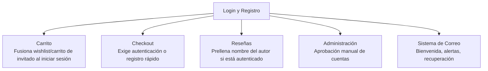

# Diagrama: Arquitectura del Módulo - Login y Registro

## Descripción

Este diagrama muestra la arquitectura del módulo de Login y Registro, sus componentes,
entidades de base de datos y relaciones.

---

## Arquitectura de Componentes



---

## Flujo de Datos

```mermaid
graph LR
    A["👤 Usuario envía formulario"]
    B["🎫 Token Manager<br/>valida CSRF"]
    C["🚫 Login Attempt Manager<br/>verifica bloqueo"]
    D["🔑 Authentication Manager<br/>valida credenciales"]
    E["💾 customer, customer_group"]
    F["✅ Sesión creada /<br/>❌ Error"]

    A --> B
    B --> C
    C --> D
    D --> E
    E --> F

    G["📝 Registro exitoso"]
    F --> G
    G --> H["📧 Mail Manager<br/>correo bienvenida"]
    H --> I["📋 customer_approval<br/>si el grupo lo requiere"]
```



---

## Componentes Clave

### 🔑 Authentication Manager
**Responsabilidad**: Orquestar login, registro y validación de credenciales
- Verificar email + contraseña contra el hash almacenado
- Crear la sesión autenticada tras un login exitoso
- Coordinar la creación de la cuenta durante el registro

### 🎫 Token Manager
**Responsabilidad**: Generar y validar tokens de seguridad
- `login_token` / `register_token` (protección CSRF de formularios)
- `customer_token` (sesión autenticada, expira en 10 minutos)
- Tokens de recuperación de contraseña (`customer_reset.code`)

### 🚫 Login Attempt Manager
**Responsabilidad**: Prevenir ataques de fuerza bruta
- Contar intentos fallidos por correo + IP en la última hora
- Bloquear el acceso al superar `config_login_attempts`
- Limpiar el historial tras un login exitoso

### 📧 Mail Manager
**Responsabilidad**: Notificaciones relacionadas a la cuenta
- Correo de bienvenida con enlace de login
- Alerta de nuevo registro al administrador
- Correo con enlace de recuperación de contraseña

---

## Integraciones



---

## Configuraciones del Módulo

```
config_customer:
  ├── config_login_attempts (int) — Máximo de intentos fallidos antes de bloquear
  ├── config_password_length (int) — Longitud mínima de contraseña (default 6)
  ├── config_password_uppercase (bool) — Exigir mayúscula
  ├── config_password_lowercase (bool) — Exigir minúscula
  ├── config_password_number (bool) — Exigir número
  ├── config_password_symbol (bool) — Exigir símbolo
  ├── config_customer_price (bool) — Ocultar precios sin autenticación
  └── config_account_id (int) — Página de términos/Privacy Policy asociada al registro

config_mail:
  ├── alert_mail (bool) — Enviar alerta de nuevo registro al administrador
  └── alert_email (string) — Correos administrativos adicionales
```

---

## Seguridad y Validación

- ✅ **Hash de contraseñas**: `password_hash()` (bcrypt), nunca texto plano
- ✅ **Protección CSRF**: tokens de 26 caracteres en login y registro
- ✅ **Rate limiting**: bloqueo de 1 hora tras exceder intentos fallidos
- ✅ **Expiración de tokens**: `customer_token` expira en 10 minutos
- ✅ **Mensajes genéricos**: el login no revela si el correo existe o no
- ⚠️ **Confirmación de contraseña**: no validada del lado del servidor en el registro — ver
  [INC-ACEPT-001](../../tests/aceptacion/incident-reports/INC-ACEPT-001-registro-sin-confirmar-password.md)
- ⚠️ **Rate limiting no confirmado en todos los flujos**: ver
  [INC-SEG-002](../../tests/no-funcionales/seguridad/incident-reports/INC-SEG-002-sin-rate-limiting-login.md)
  para la limitación de la prueba realizada sobre el login de administrador.
