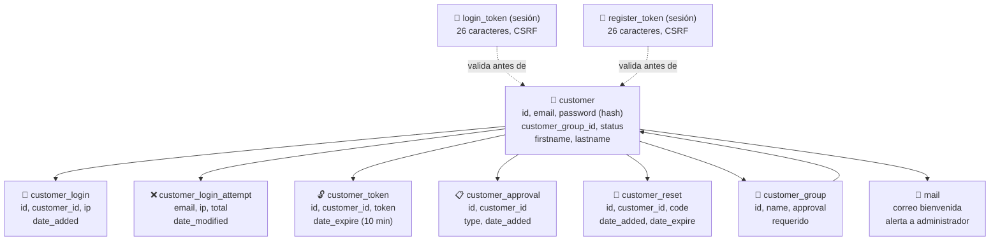

# Diagrama: Estructura de Datos - Login y Registro

## Descripción

Este diagrama muestra las entidades de base de datos involucradas en autenticación, registro,
intentos fallidos y recuperación de contraseña, y cómo se relacionan entre sí.

---

## Estructura de Entidades



---

## Entidades de Base de Datos

### 👤 customer
```
+--------------------+----------+-----+
| Campo               | Tipo     | FK  |
+--------------------+----------+-----+
| customer_id          | INT      | PK  |
| customer_group_id     | INT      | FK  |
| email                | VARCHAR  |     |
| password             | VARCHAR  |     |
| firstname            | VARCHAR  |     |
| lastname             | VARCHAR  |     |
| status               | BOOLEAN  |     |
| date_added           | DATETIME |     |
+--------------------+----------+-----+

Nota: password se guarda con hash bcrypt (password_hash()), nunca en texto plano.
status = false significa cuenta pendiente de aprobación.
```

### 🔑 customer_login
```
+--------------------+----------+-----+
| Campo               | Tipo     | FK  |
+--------------------+----------+-----+
| customer_login_id     | INT      | PK  |
| customer_id          | INT      | FK  |
| ip                   | VARCHAR  |     |
| date_added           | DATETIME |     |
+--------------------+----------+-----+

Nota: registro de auditoria de logins exitosos, usado para historial de seguridad.
```

### ❌ customer_login_attempt (bloqueo por fuerza bruta)
```
+--------------------+----------+-----+
| Campo               | Tipo     | FK  |
+--------------------+----------+-----+
| email                | VARCHAR  |     |
| ip                   | VARCHAR  |     |
| total                | INT      |     |
| date_modified        | DATETIME |     |
+--------------------+----------+-----+

Nota: se consulta con strtotime('-1 hour') para contar intentos recientes.
Se limpia (deleteLoginAttempts) tras un login exitoso.
```

### 🔓 customer_token
```
+--------------------+----------+-----+
| Campo               | Tipo     | FK  |
+--------------------+----------+-----+
| customer_token_id     | INT      | PK  |
| customer_id          | INT      | FK  |
| token                | VARCHAR  |     |
| date_expire          | DATETIME |     |
+--------------------+----------+-----+

Nota: expira automaticamente a los 10 minutos desde su creacion.
```

### 📋 customer_approval
```
+--------------------+----------+-----+
| Campo               | Tipo     | FK  |
+--------------------+----------+-----+
| customer_approval_id  | INT      | PK  |
| customer_id          | INT      | FK  |
| type                 | VARCHAR  |     |
| date_added           | DATETIME |     |
+--------------------+----------+-----+

Nota: se genera solo cuando el customer_group requiere aprobacion manual.
```

### 🔁 customer_reset (recuperación de contraseña)
```
+--------------------+----------+-----+
| Campo               | Tipo     | FK  |
+--------------------+----------+-----+
| customer_reset_id     | INT      | PK  |
| customer_id          | INT      | FK  |
| code                 | VARCHAR  |     |
| date_added           | DATETIME |     |
| date_expire          | DATETIME |     |
+--------------------+----------+-----+

Nota: code es el token de 26 caracteres enviado por correo. Se elimina tras usarse
o al detectarse inconsistencias (codigo incorrecto/vencido).
```

### 👥 customer_group
```
+--------------------+----------+-----+
| Campo               | Tipo     | FK  |
+--------------------+----------+-----+
| customer_group_id     | INT      | PK  |
| name                 | VARCHAR  |     |
| approval             | BOOLEAN  |     |
+--------------------+----------+-----+

Nota: approval=true fuerza el flujo de customer_approval al registrarse en ese grupo.
```

---

## Relaciones Clave

```
customer_group (1) ──── (N) customer
customer (1) ──── (N) customer_login       [historial de logins exitosos]
customer (1) ──── (N) customer_token       [tokens de sesión activos, expiran 10 min]
customer (1) ──── (0..1) customer_approval [solo si el grupo requiere aprobación]
customer (1) ──── (N) customer_reset       [tokens de recuperación de contraseña]

email + ip ──── (N) customer_login_attempt [independiente de si la cuenta existe]
```

---

## Ciclo de Vida de los Tokens

| Token | Duración | Propósito | Se elimina cuando |
|---|---|---|---|
| `login_token` | Duración de la sesión de login | Protección CSRF del formulario de login | Al usarse exitosamente |
| `register_token` | Duración de la sesión de registro | Protección CSRF del formulario de registro | Tras un registro exitoso |
| `customer_token` | 10 minutos | Identifica la sesión autenticada del cliente | Al expirar o al cerrar sesión |
| `customer_reset.code` | Configurable (recomendado corto) | Habilita el cambio de contraseña | Al usarse, o al detectar inconsistencia |
