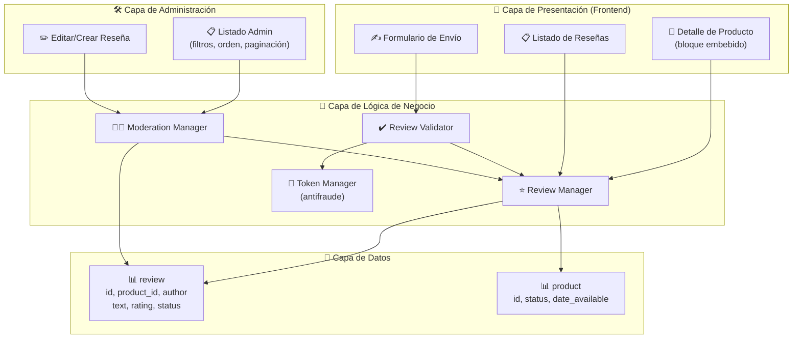
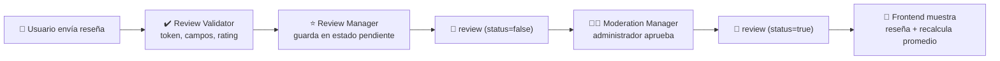
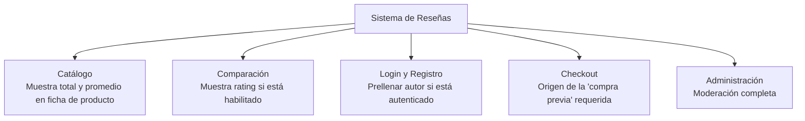

# Diagrama: Arquitectura del Módulo - Sistema de Reseñas

## Descripción

Este diagrama muestra la arquitectura del módulo de Sistema de Reseñas, sus componentes,
entidades de base de datos y relaciones.

---

## Arquitectura de Componentes



---

## Flujo de Datos



---

## Componentes Clave

### ⭐ Review Manager
**Responsabilidad**: Gestión central de reseñas
- Consultar reseñas publicadas de un producto (paginado, ordenado por fecha)
- Calcular calificación promedio y total de reseñas
- Guardar nuevas reseñas en estado pendiente

### ✔️ Review Validator
**Responsabilidad**: Validar el envío de una reseña nueva
- Verificar longitud de autor y texto
- Validar que el rating esté entre 1 y 5
- Verificar requisitos de autenticación/compra previa según configuración
- Validar captcha cuando esté habilitado

### 🎫 Token Manager
**Responsabilidad**: Protección antifraude
- Generar `review_token` por sesión
- Validar el token en cada envío de formulario

### 👨‍💼 Moderation Manager
**Responsabilidad**: Gestión administrativa de reseñas
- Listar con filtros (producto, autor, estado, rango de fechas)
- Aprobar, editar o eliminar reseñas
- Ordenar por producto, autor, rating o fecha

---

## Integraciones



---

## Configuraciones del Módulo

```
config_review:
  ├── config_review_guest (bool) — Permitir reseñas de invitados
  ├── config_review_only_buyers (bool) — Exigir compra previa para reseñar
  ├── config_review_captcha (bool) — Requerir captcha en el envío
  └── config_review_page_size (int) — Reseñas por página (default 5)
```

---

## Seguridad y Validación

- ✅ **Moderación obligatoria**: ninguna reseña se publica automáticamente, siempre requiere
  aprobación manual
- ✅ **Protección antifraude**: token de 32 caracteres por sesión, distinto del CSRF de
  login/registro
- ✅ **Consistencia con catálogo**: reseñas de productos inactivos se ocultan automáticamente
  sin necesidad de eliminarlas
- ✅ **Errores estructurados por campo**: verificado directamente contra `upload/` (envío de
  reseña con rating fuera de rango)
- ⏳ **Moderación end-to-end no verificada de punta a punta**: ver
  [tests/aceptacion/6-Sistema-de-Resenas.md](../../tests/aceptacion/6-Sistema-de-Resenas.md)
