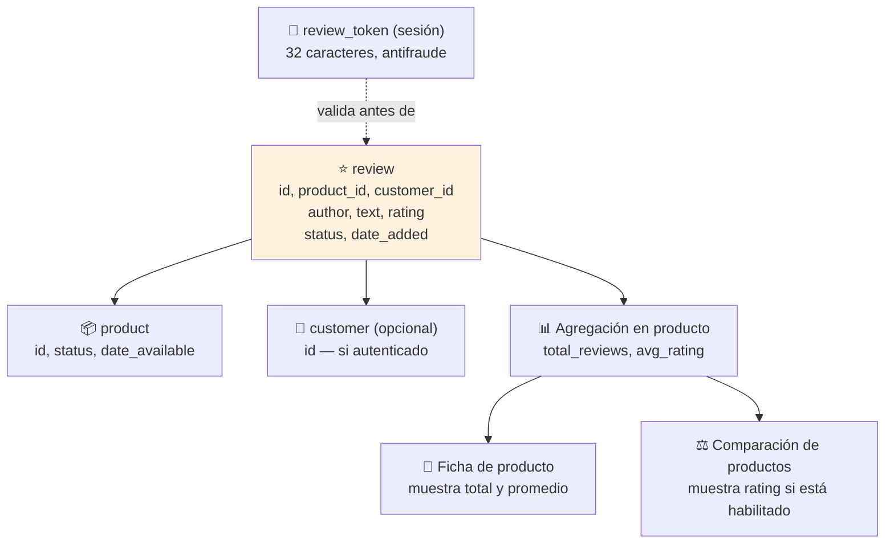

# Diagrama: Estructura de Datos - Sistema de Reseñas

## Descripción

Este diagrama muestra las entidades involucradas en la creación, publicación y moderación de
reseñas de productos.

---

## Estructura de Entidades



---

## Entidades de Base de Datos

### ⭐ review
```
+------------------+----------+-----+
| Campo            | Tipo     | FK  |
+------------------+----------+-----+
| review_id          | INT      | PK  |
| product_id         | INT      | FK  |
| customer_id        | INT      | FK  |
| author            | VARCHAR  |     |
| text              | TEXT     |     |
| rating            | INT      |     |
| status            | BOOLEAN  |     |
| date_added        | DATETIME |     |
| date_modified     | DATETIME |     |
+------------------+----------+-----+

Nota: status=false (pendiente) es el estado por defecto al crear.
Solo status=true (aprobado) se cuenta y se muestra en frontend.
customer_id puede ser NULL/0 si la reseña fue de un invitado.
```

### 🎫 review_token (sesión, no persistido en BD)
```
+------------------+----------+
| Campo            | Tipo     |
+------------------+----------+
| token             | VARCHAR  |
+------------------+----------+

Nota: generado por sesion (32 caracteres), se valida en el envio del formulario para
prevenir envios automatizados repetidos.
```

---

## Relaciones Clave

```
product (1) ──── (N) review              [todas las reseñas de un producto]
customer (0..1) ──── (N) review           [reseñas de clientes autenticados]
review (N) ──── (1) status                [pendiente / publicado]
```

---

## Condiciones para que una Reseña Cuente en el Frontend

Una reseña solo se incluye en el total mostrado y en el listado público si **todas** estas
condiciones se cumplen simultáneamente:

```
review.status = true (aprobada)
  AND product.status = true (producto activo)
  AND product.date_available <= hoy (producto vigente)
```

Esto significa que aprobar una reseña de un producto que luego se desactiva la oculta
automáticamente, sin necesidad de eliminarla manualmente.

---

## Estados de una Reseña

| Estado | `status` | Visible en frontend | Cuenta para el total | Acción disponible en admin |
|---|---|---|---|---|
| **Pendiente** | `false` | ❌ No | ❌ No | Aprobar / Eliminar |
| **Publicada** | `true` | ✅ Sí (si producto activo/vigente) | ✅ Sí | Editar / Eliminar |
| **Oculta por producto inactivo** | `true` | ❌ No (aunque `status=true`) | ❌ No | — |
