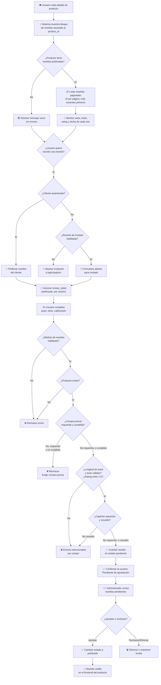

# Diagrama: Flujo del Sistema de Reseñas

## Descripción

Este diagrama muestra cómo un cliente visualiza y escribe reseñas de un producto, y cómo el
administrador modera esas reseñas antes de que se publiquen.

---

## Flujo del Sistema de Reseñas

---

## Puntos Clave

1. **Moderación obligatoria**: ninguna reseña aparece públicamente de inmediato — siempre queda
   en estado pendiente hasta que un administrador la aprueba.
2. **Protección antifraude**: cada envío requiere un `review_token` generado por sesión, similar
   al patrón de CSRF usado en login/registro.
3. **Reseña condicionada a compra**: configurable — la tienda puede exigir que el cliente haya
   comprado el producto antes de poder reseñarlo.
4. **Invitados opcionales**: la tienda decide si permite reseñas sin autenticación.
5. **Paginación fija**: 5 reseñas por página, ordenadas de más reciente a más antigua.

---

## Escenarios Cubiertos

- ✅ Ver reseñas publicadas de un producto (verificado contra `upload/`)
- ✅ Producto sin reseñas muestra estado vacío sin error (verificado contra `upload/`)
- ✅ Envío de reseña válida con confirmación de "pendiente de aprobación" (verificado contra `upload/`)
- ✅ Rechazo por calificación fuera de rango (1-5)
- ⏳ Aprobación desde el panel admin y verificación de visibilidad posterior — pendiente de
  prueba manual (ver
  [Historia de Usuario 3](../../tests/aceptacion/6-Sistema-de-Resenas.md#historia-de-usuario-3-las-reseñas-no-aparecen-públicamente-hasta-ser-aprobadas))
- ⏳ Moderación completa (filtrar, editar, eliminar desde admin) — pendiente de prueba manual
